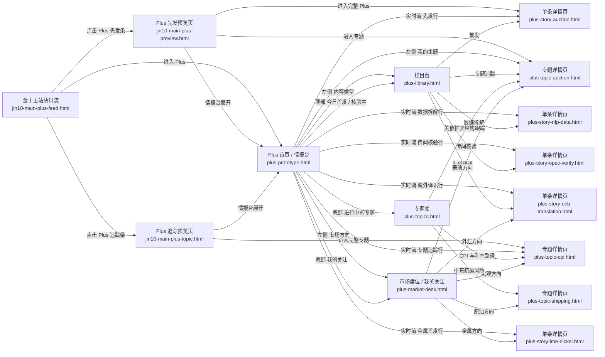

# Jin10 Plus 页面流转图

## 页面关系

## 核心说明

- `栏目台` 的主要入口在 `Plus 首页` 左侧 `内容类型`。
- `栏目台` 的次级入口在 `Plus 首页` 顶部统计卡，比如 `今日首发`、`核验中`。
- `专题库` 是从首页底部 `进行中的专题` 进入。
- `市场席位 / 我的关注` 是从首页左侧 `市场方向`、底部 `我的关注` 进入。
- `主站快讯流` 里的 `Plus` 条目是曝光入口，不替代 `Plus 首页`。
